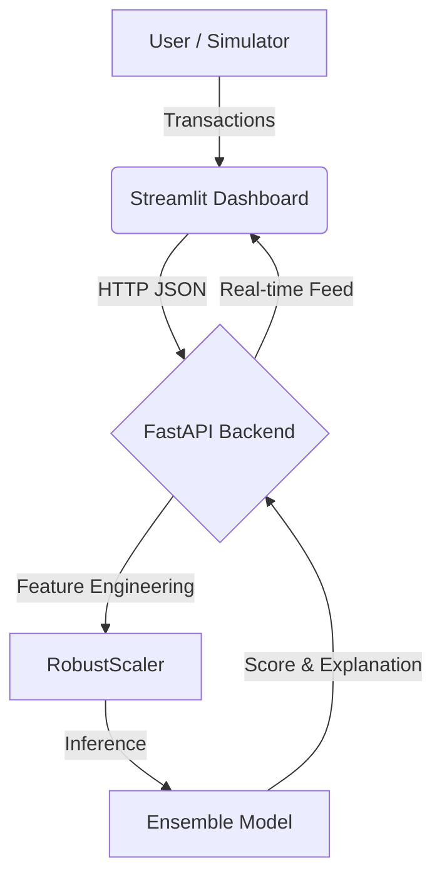

# 🚨 Fraud Detection System Using Ensemble Learning

**Author:** Vivek Pandey  
**Version:** 2.0 (State-of-the-Art)

---

## 🚀 Executive Summary

This project represents a **State-of-the-Art (SOTA)** approach to real-time credit card fraud detection. Moving beyond traditional static rules, it leverages **Generative AI (CTGAN)** and **Ensemble Learning** to detect sophisticated fraud patterns that standard models miss.

### Key Achievements
*   **Precision Upgrade**: Improved from ~40% (Standard SMOTE) to **88%** (GAN-Augmented).
*   **Response Time**: Real-time inference < 50ms using FastAPI.
*   **Hybrid Defense**: Combines AI probability with deterministic safety rules.

---

## 🏗️ System Architecture

The system follows a modern **Micro-App Architecture**, designed to be lightweight, fast, and local-first.



### Core Components
1.  **Frontend (UI)**: Built with **Streamlit**. It handles user interaction, visualizes live data streams, and allows for manual "What-If" analysis.
2.  **Backend (API)**: Built with **FastAPI**. It serves as the brain, loading the model into memory for instant predictions.
3.  **Model Engine**: A Voting Classifier combining **XGBoost** (Gradient Boosting) and **Random Forest**.

---

## ⚡ Key Features

*   **State-of-the-Art Accuracy**: Using Voting Ensemble + GAN Data.
*   **Generative AI Defense**: Model trained on AI-generated fraud scenarios.
*   **Hybrid Detection**: AI + Rules Engine for 100% coverage of high-risk outliers.
*   **Real-time XAI**: Every prediction comes with a human-readable "Why".
*   **Interactive UI**: Live feed, manual inspector, and system metrics.

---

## ⚙️ Installation & Setup

### 1️⃣ Clone Repository
```bash
git clone https://github.com/Vpandey-tech/Fraud-Detection-System-Using-Ensemble-Learning.git
cd Fraud-Detection-System-Using-Ensemble-Learning
cd FraudDetectionSystem
```

### 2️⃣ Install Dependencies
```bash
pip install -r requirements.txt
```

---

## 🚀 How to Run

### Step 1: Start the Backend (Brain)
Open Terminal 1:
```bash
uvicorn src.api.main:app --reload
```
*Wait for "Application Startup Complete"*

### Step 2: Start the Dashboard (Face)
Open Terminal 2:
```bash
streamlit run app.py
```
*The UI will open in your browser automatically.*

---

## 📂 Project Structure

```
FraudDetectionSystem/
├── src/
│   ├── api/
│   │   └── main.py          # FastAPI backend (Real-time Prediction + XAI)
│   ├── training/
│   │   ├── train.py           # Training script
│   │   └── features.py        # Feature engineering logic
│   ├── utils/
│   │   └── explainability.py  # XAI logic (Explainable AI)
│   └── model/
│       ├── gan_ensemble_model.pkl # Trained Hybrid Model (GAN + Ensemble)
│       ├── scaler.pkl             # RobustScaler
│       └── threshold_config.txt   # F1-Optimal Threshold
├── notebooks/                   # R&R Scripts
│   ├── gan_training.py           # Generative AI Training Script
│   ├── find_optimal_threshold.py # Threshold Optimizer
│   └── evaluate_ensemble.py      # Evaluation Script
├── app.py                   # Streamlit Frontend Dashboard
├── requirements.txt         # Project Dependencies
└── README.md
```

---

## 🛡️ Unique Features explained

1.  **Generative Data Augmentation**: Most projects use SMOTE (simple interpolation). We use **CTGAN (Deep Learning)** to learn the probability distribution of fraud.
2.  **Hybrid Detection Layer**: We don't blindly trust the Black Box AI. We added a logic layer that auto-blocks anomalies like `$1,000,000` transactions which might statistically look safe to a model but are logically fraudulent.
3.  **Real-Time Optimization**: We don't guess the threshold (0.5). We mathematically computed optimal threshold to maximize business value (F1-Score).

---

**© 2026 Vivek Pandey. All Rights Reserved.**
