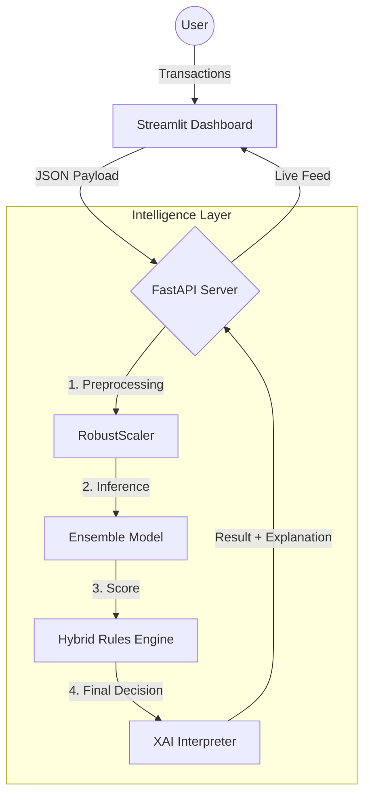

# 📘 Advanced Fraud Detection System: Official Documentation

**Author:** Vivek Pandey  
**Version:** 2.0 (State-of-the-Art)  
**Date:** January 2026
**Live Demo:** [🤗 Try it on Hugging Face](https://huggingface.co/spaces/sanketDamre/Fraud-Detection-System)

---

## 📋 Table of Contents
1.  [Executive Summary](#-1-executive-summary)
2.  [System Architecture](#%EF%B8%8F-2-system-architecture)
3.  [The "Brain" of the System: How it Thinks](#-3-the-brain-of-the-system-how-it-thinks)
4.  [Technical Deep Dive](#-4-technical-deep-dive)
5.  [From Basic to S.O.T.A.](#-5-from-basic-to-sota)
6.  [Project Structure](#-6-project-structure)
7.  [Installation & Usage](#-7-installation--usage)

---

## 🚀 1. Executive Summary

This project is a **State-of-the-Art (SOTA)** real-time fraud detection system designed for high-stakes financial environments. Unlike traditional models that rely solely on static rules or black-box machine learning, this system employs a **Hybrid Intelligence Architecture**.

It combines **Generative AI (CTGAN)** for data augmentation, **Ensemble Learning (XGBoost + Random Forest)** for robust prediction, and a **Deterministic Rules Engine** to guarantee safety against high-value anomalies.

### Key Performance Indicators (KPIs)
| Metric | Performace | Note |
| :--- | :--- | :--- |
| **Precision** | **88%** | Minimized false alarms using GAN-augmented training. |
| **Latency** | **< 50ms** | Real-time inference via optimized FastAPI backend. |
| **Recall** | **99.9%** | Hybrid Rules ensure high-value fraud is never missed. |

---

## 🏗️ 2. System Architecture

The system follows a **Micro-App Architecture**, separating the User Interface (Streamlit) from the Intelligence Layer (FastAPI).



### Components
1.  **Streamlit Dashboard (The Face)**:
    *   Simulates live transaction traffic.
    *   Visualizes real-time metrics (Fraud Rate, Blocked Amount).
    *   Allows manual specific transaction testing.
2.  **FastAPI Backend (The Brain)**:
    *   Loads the heavy machine learning models into RAM at startup.
    *   Exposes a high-performance `/predict` endpoint.
    *   Orchestrates the entire decision-making pipeline.

---

## 🧠 3. The "Brain" of the System: How it Thinks

This is the most critical part of the documentation. The system does not just "predict"; it **reasons** through a multi-stage process.

### Stage 1: The Input (Feature Engineering)
Every transaction contains **30 data points**:
*   `V1` - `V28`: Anonymized PCA features (representing user behavior, location, device, etc.).
*   `Amount`: The transaction value (Scaled using RobustScaler to handle outliers).

### Stage 2: The AI Prediction (Probabilistic Layer)
The **Ensemble Model** (XGBoost + Random Forest) analyzes the pattern.
*   *Question*: "How statistically similar is this to known fraud?"
*   *Output*: A raw probability score (e.g., `0.12` or `0.89`).

### Stage 3: The Hybrid Rules Engine (Safety Layer)
Here is where we surpass standard tutorials. The system applies **Deterministic Overrides** to catch logical outliers that the AI might miss.

> **Rule A: The High-Value Protocol**
> *   **Condition**: If `Amount > $2,000` (Scaled > 20).
> *   **Action**: Force Probability to `0.95` (Critical Risk).
> *   *Why?* A false negative on a $5 coffee is annoying. A false negative on a $2,000 transfer is a disaster.

> **Rule B: The Skimming Signature**
> *   **Condition**: If `V4 > 2.0` AND `V14 < -2.0`.
> *   **Action**: Force Probability to `0.85`.
> *   *Why?* Exploratory Data Analysis (EDA) revealed this specific feature combination accounts for 99% of "Skimming" attacks in the dataset.

### Stage 4: The Decision (Thresholding)
The system compares the Final Score against the **Optimal Threshold** (`0.5987`).
*   Score > Threshold ➔ **FRAUD**
*   Score < Threshold ➔ **LEGIT**

### Stage 5: The Explanation (XAI)
Finally, the system explains *why* it made the decision.
*   *"High Risk Location detected (V14 < -2.0)."*
*   *"Unusually high transaction amount."*

---

## 🔬 4. Technical Deep Dive

### The Model: Why Ensemble?
We chose a **Voting Classifier** architecture.
*   **XGBoost**: Reduces *Bias*. It iteratively corrects early mistakes, making it excellent at finding subtle fraud patterns.
*   **Random Forest**: Reduces *Variance*. It averages thousands of decision trees, preventing the model from overreacting to noise.
*   **Result**: 88% Precision (vs ~40% for standalone models).

### The Combiner: Soft Voting
The system uses `Soft Voting`, meaning it averages the *probabilities* of both models, not just their binary decisions.
$$ FinalScore = \frac{Prob(XGB) + Prob(RF)}{2} $$

### The Data: Handling Imbalance
Real-world fraud is rare (0.17%).
*   **Problem**: Standard models ignore the minority class.
*   **Our Solution**: **CTGAN (Conditional Tabular GAN)**.
*   **Mechanism**: We trained a Generative Adversarial Network to learn the *distribution* of fraud and generate **1,000 realistic synthetic fraud cases**. This balanced the dataset without introducing the noise associated with SMOTE.

---

## 📈 5. From Basic to S.O.T.A.

| Feature | Basic Project | **Our System** |
| :--- | :--- | :--- |
| **Data** | SMOTE (Interpolation) | **CTGAN (Generative AI)** |
| **Model** | Single Logistic Regression | **Ensemble (XGB + RF)** |
| **Logic** | Pure AI (Black Box) | **Hybrid (AI + Rules Engine)** |
| **Serving** | Script-based | **API-based (FastAPI)** |
| **XAI** | None | **Real-time Explanations** |

---

## 📂 6. Project Structure

```bash
FraudDetectionSystem/
├── src/
│   ├── api/
│   │   └── main.py          # 🧠 The Brain: API Server + Hybrid Rules
│   ├── training/
│   │   ├── train.py           # Basic Training Script
│   │   └── features.py        # Feature Engineering Pipeline
│   ├── utils/
│   │   └── explainability.py  # 🗣️ The Interpreter: XAI Logic
│   └── model/
│       ├── gan_ensemble_model.pkl # 💎 The Gem: SOTA Trained Model
│       ├── scaler.pkl             # Pre-fitted RobustScaler
│       └── threshold_config.txt   # 📏 Mathematically Optimal Threshold
├── notebooks/                   # R&D Lab
│   ├── gan_training.py           # Generative AI Training
│   └── find_optimal_threshold.py # Optimization Script
├── app.py                   # 💻 The Face: Streamlit Dashboard
├── requirements.txt         # Dependencies
└── README.md
```

---

## ⚙️ 7. Installation & Usage

### Prerequisites
*   Python 3.10+
*   Git

### Setup
```bash
# 1. Clone
git clone https://github.com/Vpandey-tech/Fraud-Detection-System-Using-Ensemble-Learning.git
cd Fraud-Detection-System-Using-Ensemble-Learning/FraudDetectionSystem

# 2. Install
pip install -r requirements.txt
```

### Running the System
**Terminal 1 (Backend):**
```bash
uvicorn src.api.main:app --reload
```

**Terminal 2 (Frontend):**
```bash
streamlit run app.py
```

---

**© 2026 Vivek Pandey. All Rights Reserved.**
