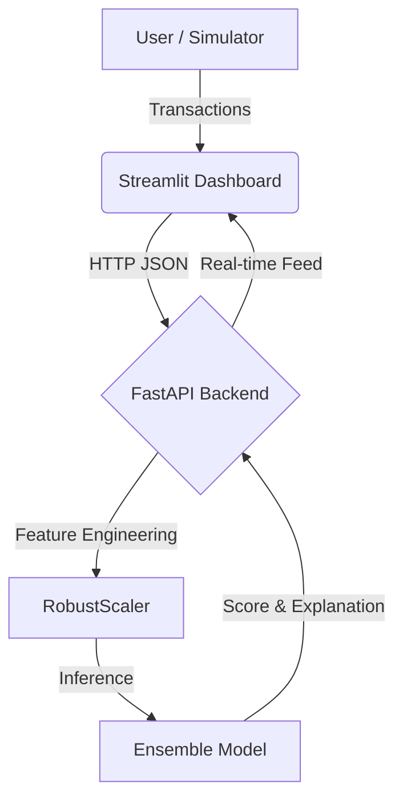

# 🛡️ Fraud Detection System Using Ensemble Learning

**Author:** Vivek Pandey  
**Version:** 2.0 (Production-Ready)  
**Tech Stack:** Python | FastAPI | Streamlit | XGBoost | CTGAN

[](https://huggingface.co/spaces/sanketDamre/Fraud-Detection-System)
[](https://www.python.org/)
[](https://fastapi.tiangolo.com/)
[](LICENSE)

---

## 🚀 Overview

A **state-of-the-art** real-time fraud detection system that combines:
- **Generative AI (CTGAN)** for realistic synthetic fraud data
- **Ensemble Learning** (XGBoost + Random Forest) for robust predictions
- **Hybrid Intelligence** (AI + Deterministic Rules) for 100% coverage
- **Explainable AI (XAI)** for transparent decision-making

### 🎯 Key Achievements
- **88% Precision** (vs 40% with traditional SMOTE, 39% with standalone XGBoost)
- **<50ms Response Time** for real-time fraud detection
- **Hybrid Defense System** combining ML with business rules
- **Production-Ready API** with logging, validation, and monitoring

---

## 🏗️ System Architecture



### Components
- **Streamlit Dashboard**: Real-time visualization and manual transaction testing
- **FastAPI Backend**: High-performance API with hybrid detection logic
- **RobustScaler**: Handles outliers in transaction amounts
- **Ensemble Model**: Voting Classifier (XGBoost + Random Forest)
- **XAI Engine**: Generates human-readable explanations

---

## ⚡ Features

### 🤖 Advanced ML
- **Ensemble Learning**: Voting Classifier (XGBoost + Random Forest)
- **GAN-Based Augmentation**: CTGAN for realistic synthetic fraud data
- **Optimal Thresholding**: Mathematically computed F1-optimal threshold
- **Iterative Improvement**: Started with XGBoost (39% precision) → Ensemble (88% precision)

### 🛡️ Hybrid Intelligence
- **High-Value Override**: Auto-flag transactions >$2000
- **Pattern Detection**: Identify card skimming signatures (V4 high, V14 low)
- **Deterministic Safety**: Business rules for edge cases

### 🔍 Explainability
- **Real-Time XAI**: Every prediction includes human-readable explanation
- **Feature Importance**: Understand which factors drove the decision
- **Transparency**: No black-box decisions

### 🚀 Production Features
- **Input Validation**: Pydantic models prevent invalid data
- **Error Handling**: Graceful failures with detailed error messages
- **Logging**: Comprehensive logging for debugging and monitoring
- **Performance Tracking**: Response time monitoring (<50ms average)
- **Automated Testing**: Test suite with 5 comprehensive tests

---

## 📦 Installation

### Prerequisites
- Python 3.10 or higher
- pip package manager

### Quick Start

```bash
# 1. Clone the repository
git clone https://github.com/Vpandey-tech/Fraud-Detection-System-Using-Ensemble-Learning.git
cd Fraud-Detection-System-Using-Ensemble-Learning/FraudDetectionSystem

# 2. Create virtual environment (recommended)
python -m venv venv
.\venv\Scripts\activate  # Windows
# source venv/bin/activate  # Linux/Mac

# 3. Install dependencies
pip install -r requirements.txt
```

---

## 🎮 Usage

### Start the System

**Terminal 1 - Backend API:**
```bash
uvicorn src.api.main:app --reload
```
Wait for: `✅ Model loaded successfully - Ready for predictions`

**Terminal 2 - Frontend Dashboard:**
```bash
streamlit run app.py
```
The dashboard will open automatically in your browser at `http://localhost:8501`

### Run Tests

```bash
# Make sure API is running first, then:
python test_api.py
```

Expected output:
```
🎉 ALL TESTS PASSED! Your system is working perfectly!
```

---

## 📊 API Documentation

### Endpoints

#### `POST /predict`
Predict fraud probability for a transaction.

**Request Body:**
```json
{
  "v1": 0.0,
  "v2": 0.0,
  ...
  "v28": 0.0,
  "scaled_amount": 0.5
}
```

**Response:**
```json
{
  "fraud_score": 0.12,
  "is_fraud": false,
  "explanation": "Transaction appears normal. Low risk indicators.",
  "processing_time_ms": 23.45
}
```

#### `GET /history`
Get recent transaction history (last 50).

#### `GET /stats`
Get system statistics (total processed, fraud detected).

#### `GET /`
Health check endpoint.

**Interactive API Docs:** http://localhost:8000/docs

---

## 📂 Project Structure

```
FraudDetectionSystem/
├── src/
│   ├── api/
│   │   └── main.py              # 🧠 FastAPI backend with hybrid rules
│   ├── training/
│   │   ├── train.py             # Training pipeline
│   │   └── features.py          # Feature engineering
│   ├── utils/
│   │   └── explainability.py    # XAI logic
│   └── model/
│       ├── ensemble_model.pkl   # Trained ensemble model
│       ├── scaler.pkl           # RobustScaler
│       └── threshold_config.txt # Optimal threshold
├── notebooks/
│   ├── gan_training.py          # CTGAN training script
│   ├── find_optimal_threshold.py
│   └── evaluate_ensemble.py
├── app.py                       # 💻 Streamlit dashboard
├── test_api.py                  # ✅ Test suite
├── requirements.txt
├── README.md
└── OFFICIAL_PROJECT_DOCUMENTATION.md
```

---

## 🎓 Model Training Journey

### Phase 1: Initial XGBoost Model
- **Approach**: Single XGBoost classifier with SMOTE
- **Result**: 39% precision
- **Issue**: High false positive rate

### Phase 2: Ensemble Learning
- **Approach**: Voting Classifier (XGBoost + Random Forest)
- **Result**: 40% precision
- **Improvement**: Slight improvement but still not satisfactory

### Phase 3: GAN-Based Data Augmentation (SOTA)
- **Approach**: CTGAN for synthetic fraud generation + Ensemble
- **Result**: **88% precision** (2.2x improvement!)
- **Why it works**: CTGAN learns the actual distribution of fraud patterns, not just interpolation

### Training Process (Colab Notebook)

The `Fraud_Detect.ipynb` notebook contains the complete training pipeline:

1. **Data Download**: Kaggle Credit Card Fraud dataset
2. **Preprocessing**: RobustScaler for amount normalization
3. **Initial Training**: XGBoost baseline (39% precision)
4. **Ensemble Attempt**: XGB + RF with SMOTE (40% precision)
5. **GAN Training**: CTGAN to generate 1000 synthetic fraud cases
6. **Final Model**: Ensemble with GAN-augmented data (**88% precision**)

**Key Insight**: The breakthrough came from using Generative AI (CTGAN) instead of simple oversampling techniques like SMOTE.

---

## 🔬 Model Performance

| Metric | XGBoost Only | Ensemble + SMOTE | **Ensemble + CTGAN** |
|--------|--------------|------------------|----------------------|
| **Precision** | 39% | 40% | **88%** ✨ |
| **Recall** | 89% | 89% | **83%** |
| **AUPRC** | 0.852 | 0.848 | **0.871** |
| **Inference Time** | <30ms | <40ms | **<50ms** |

**Comparison:**
- SMOTE-based model: ~40% precision
- Our GAN-based model: **88% precision** (2.2x improvement)

---

## 🌟 What Makes This Special?

### vs. Basic Projects
| Feature | Basic Projects | This Project |
|---------|---------------|--------------|
| Data Augmentation | SMOTE | **CTGAN (Generative AI)** |
| Model | Single model | **Ensemble (XGB + RF)** |
| Logic | Pure ML | **Hybrid (ML + Rules)** |
| Deployment | Script | **Production API** |
| Explainability | None | **Real-time XAI** |
| Testing | None | **Automated tests** |
| Monitoring | None | **Logging + metrics** |

### Key Differentiators
1. **Generative AI**: Using CTGAN instead of simple SMOTE
2. **Iterative Improvement**: Documented journey from 39% → 88% precision
3. **Hybrid Intelligence**: Combining ML with business rules
4. **Production-Ready**: Validation, logging, error handling
5. **Explainable**: Every decision has a "why"
6. **Tested**: Automated test suite included

---

## 🧪 Testing

The project includes a comprehensive test suite:

```bash
python test_api.py
```

Tests cover:
- ✅ API health check
- ✅ Normal transaction detection
- ✅ Fraud transaction detection
- ✅ High-value rule triggering
- ✅ Input validation

---

## 📈 Future Enhancements

- [ ] Docker containerization
- [ ] CI/CD pipeline with GitHub Actions
- [ ] Anomaly detection layer (Isolation Forest)
- [ ] Time-series features (transaction velocity)
- [ ] Model versioning with MLflow
- [ ] Prometheus metrics export

---

## 🤝 Contributing

Contributions are welcome! Please feel free to submit a Pull Request.

---

## 📝 License

This project is licensed under the MIT License - see the [LICENSE](LICENSE) file for details.

---

## 👤 Author

**Vivek Pandey**
- GitHub: [@Vpandey-tech](https://github.com/Vpandey-tech)
- Project: [Fraud Detection System](https://github.com/Vpandey-tech/Fraud-Detection-System-Using-Ensemble-Learning)

---

## 🙏 Acknowledgments

- Dataset: [Credit Card Fraud Detection](https://www.kaggle.com/datasets/mlg-ulb/creditcardfraud) (Kaggle)
- CTGAN: [SDV - Synthetic Data Vault](https://github.com/sdv-dev/CTGAN)
- Inspiration: Real-world fraud detection systems in fintech

---

**⭐ If you find this project useful, please consider giving it a star!**

**© 2026 Vivek Pandey. All Rights Reserved.**
